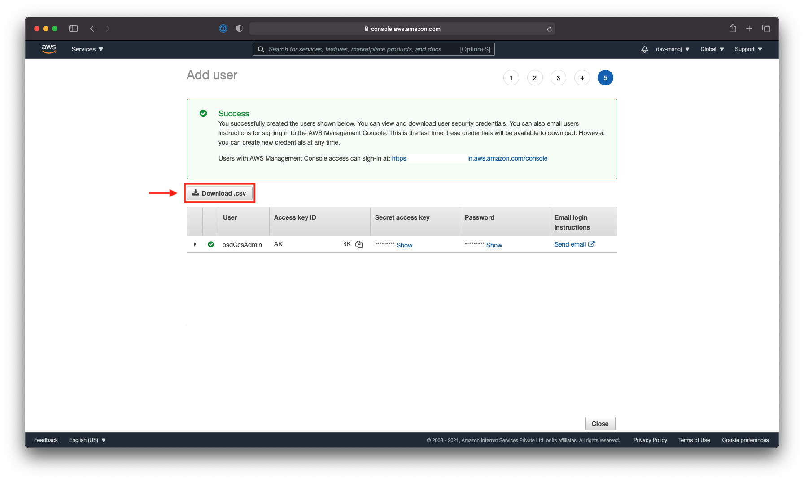
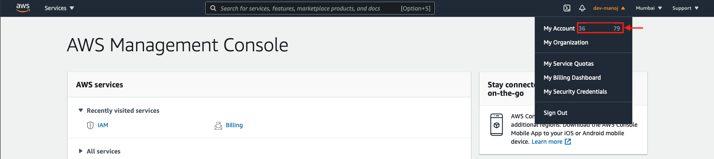

# How to setup Cloud Pak for Data on Red Hat OpenShift for AWS

In this tutorial, you will learn how to setup CPD on ROSA

## Introduction

State the purpose of your tutorial, your intended audience, and the benefits readers can gain from it. Aim to grab the reader’s interest quickly, using terms they are likely to search on and relate to.

## Prerequisites

- [AWS account](https://aws.amazon.com/) is required to complete this tutorial.
- Linux machine is required to run the terraform scripts
- [Terraform CLI](https://www.terraform.io/downloads.html) is required to run the terraform scripts.
- [AWS CLI](https://aws.amazon.com/cli/) is required to create instance on AWS.
- [Kubectl CLI](https://kubernetes.io/docs/tasks/tools/install-kubectl/) is required to run the terraform scripts.
- [ROSA CLI](https://cloud.redhat.com/products/amazon-openshift/download) is required to run the terraform scripts.

## Estimated time

CPD is a complex system that takes a few hours to setup, however using this tutorial, you will be able to setup Cloud Pak for Data in about 45 minutes.

## Steps

### Step 1: Create an OpenShift IAM user in AWS

An IAM user ***osdCcsAdmin*** within the AWS account has to be created for OpenShift installer to get access to your AWS infrastructure.

The IAM user needs at least **Programmatic access** access type enabled and this user must have the **AdministratorAccess** policy attached to it.

- Goto [Identity and Access Management (IAM)](https://console.aws.amazon.com/iam/home) on AWS console.
- Under **Access management** click on **Users**.

- Create a new user ***osdCcsAdmin*** by selecting AWS access types as follows:
  - Programmatic access
  - AWS Management Console access

- Create a user group to manage ***osdCcsAdmin*** permissions. Make sure to enable **AdministratorAccess** and create the group.

- Select the recently created user group to proceed.

- Optionally you can add Tags.

- Review the details and create a user.

- On Successfully creating ***osdCcsAdmin*** IAM User **Download csv** as you will require the **Access key ID** and the **Secret access key** in further steps.


- Also make a note of your Account ID as it will be required in further steps.


- At this point, you will have successfully created: 
  - IAM user ***osdCcsAdmin*** with required permissions.
  - **AWS access ID**, **AWS account key ID** and **AWS secret access key** credentials.

### Step 2: Create a ROSA instance and deploy Cloud Pak for Data 4.0

#### Step 2.1: Enable ROSA instance and Download ROSA CLI

- Goto the [Red Hat OpenShift service on AWS](console.aws.amazon.com/rosa/home) on your AWS console and enable the Red Hat OpenShift service.

- You will get an option to download the [ROSA CLI](https://cloud.redhat.com/products/amazon-openshift/download). Download the CLI and move it to PATH.

- In terminal, run the follwoing command to setup AWS CLI.
  ```bash
  aws configure
  ```
  ```
  AWS Access Key ID [None]: <AWS Access Key ID>
  AWS Secret Access Key [None]: <AWS Secret Access Key>
  Default region name [None]: <AWS Region>
  Default output format [None]: json
  ```
- Once the AWS CLI is configured, run the following command verify ROSA CLI.
  ```bash
  rosa verify permissions
  ```
  ```
  I: Validating SCP policies...
  I: AWS SCP policies ok
  ```

#### Step 2.2: Create ROSA instance and Deploy Cloud Pak for Data

- Clone the [GitHub repository](https://github.com/IBM/cp4d-deployment/tree/master/managed-openshift/aws/terraform) in your local machine from where you will run the terraform commands.

- In the cloned repository, update the `##### AWS Configuration #####` section in the `variables.tf` file with the **AWS access ID**, **AWS account key ID** and **AWS secret access key** obtained from [Step 1](#step-1-create-an-openshift-iam-user-in-aws).

- Update the `region`, `access_key_id` and `secret_access_key` in the `variables.tf` file with the region and credentials of your AWS account.
  ```
  variable "region" {
    description = "The region to deploy the cluster in, e.g: us-west-2."
    default     = "YOUR_NEAREST_REGION"
  }

  variable "access_key_id" {
    type        = string
    description = "YOUR_AWS_ACCESS_KEY_ID"

    validation {
      condition     = length(var.access_key_id) > 0
      error_message = "Access Key ID must be provided."
    }
  }

  variable "secret_access_key" {
    type        = string
    description = "YOUR_AWS_SECRET_ACCESS_KEY"

    validation {
      condition     = length(var.secret_access_key) > 0
      error_message = "Secret Access Key must be provided."
    }
  }

  ```

- Also generate the [ROSA Token](https://cloud.redhat.com/openshift/token/rosa) and update the `rosa_token` section in the `variables.tf` file with the token that you generated.

  ```
  variable "rosa_token" {
    type = string
    default = "YOUR_ROSA_TOKEN"
  }
  ```

- You can refer to the [VARIABLES.md](https://github.com/IBM/cp4d-deployment/blob/master/managed-openshift/aws/terraform/VARIABLES.md) for more details on the `variables.tf` file and environment configuration.

- The following components of the Cloud Pak for Data 4.0 can be deployed on OpenShift through the Terraform script:
  - Data Virtualization
  - Analytics Engine
  - Watson Knowledge Catalog
  - Watson Studio
  - Watson Machine Learning
  - Watson AI OpenScale
  - Cognos Dashboard Embedded
  - DataStage
  - Db2 Warehouse
  - Db2 Advanced Edition
  - Data Management Console
  - Cognos Analytics
  - SPSS Modeler

- For example, In this tutorial you will learn how to enable Watson Studio, Cognos Analytics, Watson Machine Learning and Watson Knowledge Catalog.

- Edit the `variable.tf` file and update the `watson_studio`, `cognos_analytics`, `watson_machine_learning` and `watson_knowledge_catalog` variables to `default = yes`.

  ```
  variable "watson_studio" {
      default = "yes"
  }

  variable "cognos_analytics" {
      default = "yes"
  }

  variable "watson_machine_learning" {
    default = "yes"
  }

  variable "watson_knowledge_catalog" {
    default = "yes"
  }

  ```


## Summary

State any closing remarks about the task or goal you described and its importance. Reiterate specific benefits the reader can expect from completing your tutorial. Recommend a next step (with link if possible) where they can continue to expand their skills after completing your tutorial.

## Related links

Include links to other resources that may be of interest to someone who is reading your tutorial.
